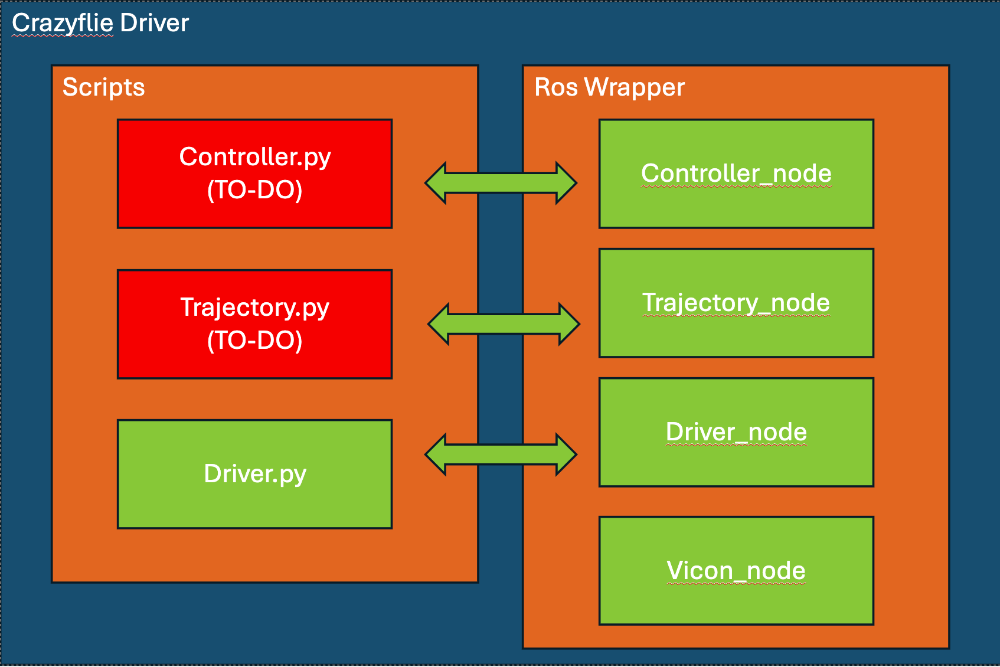
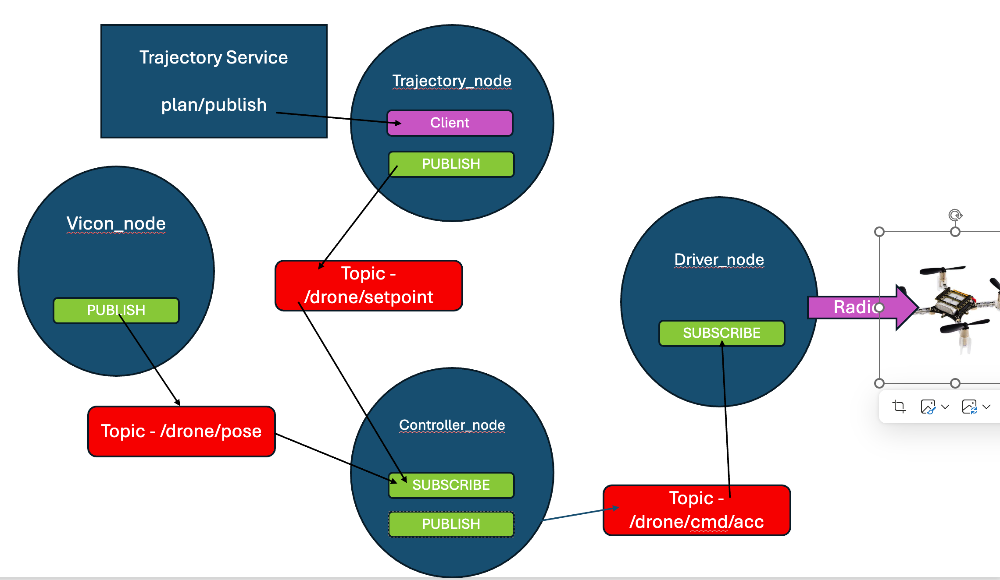

# CrazyflieDriver
### Contact Info: Karteek Gandiboyina (mkg7@illinois.edu)


This project provides a complete ROS Noetic software interface for developing and deploying advanced trajectory planners and flight controllers on the Crazyflie 2.1 nano-quadcopter


## Dependencies

- python >= 3.8
- ROS Noetic
- Ubuntu 20.04 [Preferable]


## Code Structure





## Installation

### 1. Crazyflie Client Setup

You must first set up the basic Crazyflie software. This will ensure your computer can communicate with the drone.

1. Hardware Introduction: First, familiarize yourself with the Crazyflie hardware by reading the [Getting Started Tutorial](https://www.bitcraze.io/documentation/tutorials/getting-started-with-crazyflie-2-x/).

2. Client Installation: Follow the official instructions to install the cfclient software and the necessary Python libraries for your operating system.

    - Official Guide: [Bitcraze Installation Page](https://www.bitcraze.io/documentation/repository/crazyflie-clients-python/master/installation/install/)

3. Ubuntu 20.04 Installation Example:

    ```
    # Install required system dependencies
    sudo apt update
    sudo apt install git python3-pip libxcb-xinerama0 libxcb-cursor0

    # Ensure pip is up to date
    pip3 install --upgrade pip

    # Install the cfclient package
    pip3 install cfclient

    ```

### 2. ROS Workspace Setup

1. Clone the Repository:

    Clone this package into the src folder of your catkin workspace.

    ```
    cd ~/catkin_ws/src
    git clone git@github.com:IllinoisReliableAutonomyGroup/CrazyflieDrivers.git
    ```

2. Install dependecies and build

    ```
    pip install numpy scipy casadi
    cd CrazyflieDrivers
    pip install -r requirements.txt
    cd ~/catkin_ws
    catkin_make
    source devel/setup.bash
    ```

## System Architecture

The system consists of two Packages that work in concert:

1. motion_capture_system (Vicon): 

    - Provides high-precision, real-time position and orientation data (poses) for all objects in the IRL Arena.

    - A ROS NODE /vicon_node, publishes the poses for the Crazyflie drone and the mission waypoints (gates). 
    ```
    #example
    "/cf/pose"             #crazeflies topic
    "/{object name}/pose"  #{object name} is set on vicon SDE
    ```

2. crazyflie_ros:  

    - Contains the core logic for planning and control. It includes three main nodes:
    - /trajectory_node (The Planner):
        - Subscribes to the drone and gate poses from the vicon node.
        - Plans the complete, time-optimal trajectory and publishes future setpoints for the controller.
    - /controller_node (The Controller):
        - Subscribes to the reference trajectory from the planner and the drone's current pose.
        - Calculates and publishes the necessary world-frame acceleration and yaw rate commands to follow the trajectory.
    - /driver_node (The Driver):
        - Subscribes to the acceleration and yaw rate commands from the controller.
        - Translates world accelerations to roll,pitch,yawrate and thrust command for the crazyflie.

## HOW TO USE

1. Launch the VICON

    ```
    roslaunch mocap_vicon vicon.launch 

    ```

2. Launch the trajectory node

    ```
    roslaunch crazyflie_ros trajectory.launch 

    ```

3. Launch the driver and controller Node
    
    ```
    roslaunch crazyflie_ros start_drone.launch 

    ```

4. Watch the terminal running the trajectory.launch command. Once the planner is finished, you will see the message:

    ```
    INFO: State -> READY. Call the '~start_trajectory' service to begin.

    ```

    ```
    rosservice call /trajectory_node/start_trajectory "{}"
    ```


## TODO: Task Description
Your task is to implement the core logic in two files: trajectory.py and controllers.py.

1. Trajectory Planner (crazyflie_ros/src/crazyflie_ros/trajectory.py)

    In this file, you will complete the plan() method inside the Planner class.

    Your Goal:

        Solve a trajectory optimization problem to find a dynamically feasible, time-optimal path through a series of waypoints.

    Requirements:

        The trajectory must pass through all specified waypoints (drone's start position and gate poses).

        The trajectory must be smooth and continuous.

        The trajectory must respect the drone's maximum velocity and acceleration limits (self.max_velocity = 1 m/s, self.max_acceleration = 7 m/s^2).

        The objective should be to minimize the total flight time.

        You may use CasADi to formulate and solve this optimization problem.


2. Drone Controller (crazyflie_ros/src/crazyflie_ros/controllers.py)

    In this file, you will complete the solve() method inside the DroneController class.

    Your Goal:

        Implement a flight controller that generates acceleration commands to accurately track the reference trajectory provided by the planner.

    Requirements:

        You can implement any controller of your choice, such as:

            A simple PID Controller (good starting point).

            A more advanced Model Predictive Controller (MPC) for superior tracking performance.

        Your solve function will receive the drone's current_state and a list of future reference_states (the horizon).

        Your controller must return the desired linear accelerations (ax, ay, az) and the desired yaw_rate in world frame.

Refer "crazyflie_ros/src/crazyflie_ros/controllers.py" and "crazyflie_ros/src/crazyflie_ros/trajectory.py for more detailed instructions.
